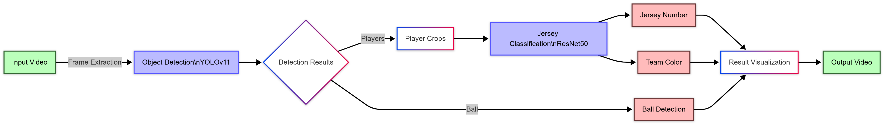
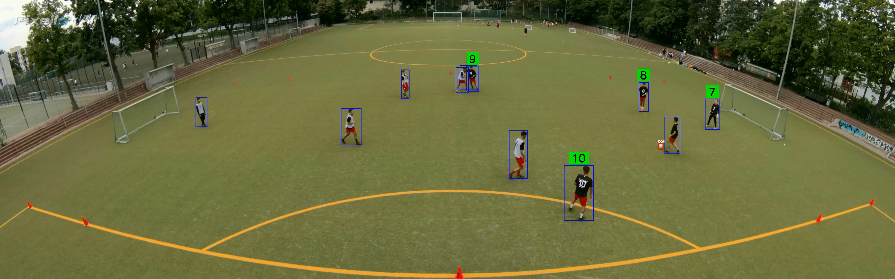
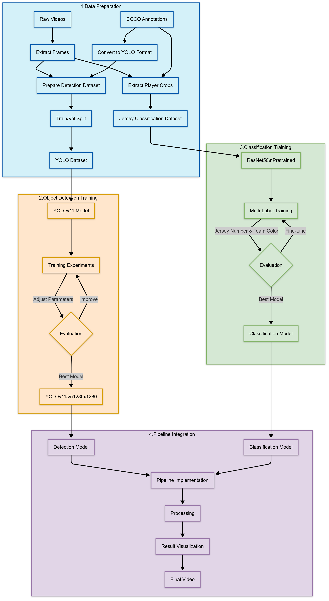
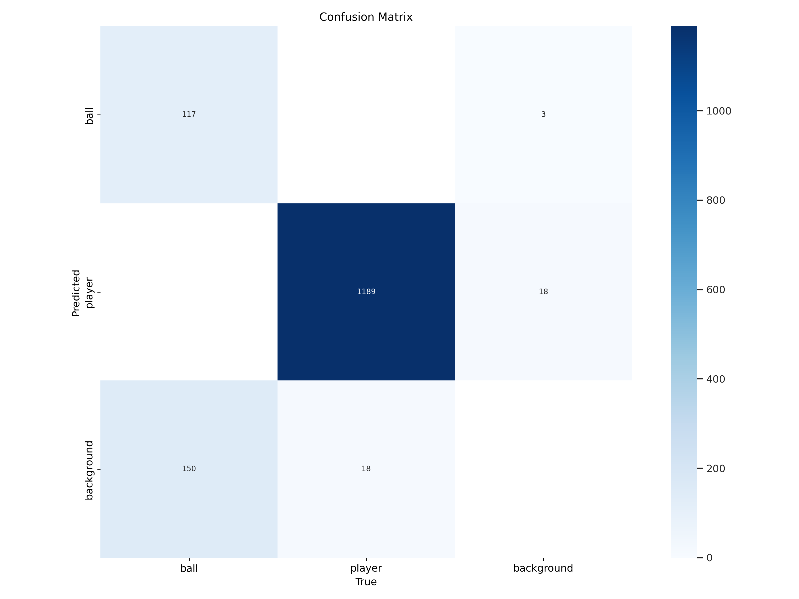
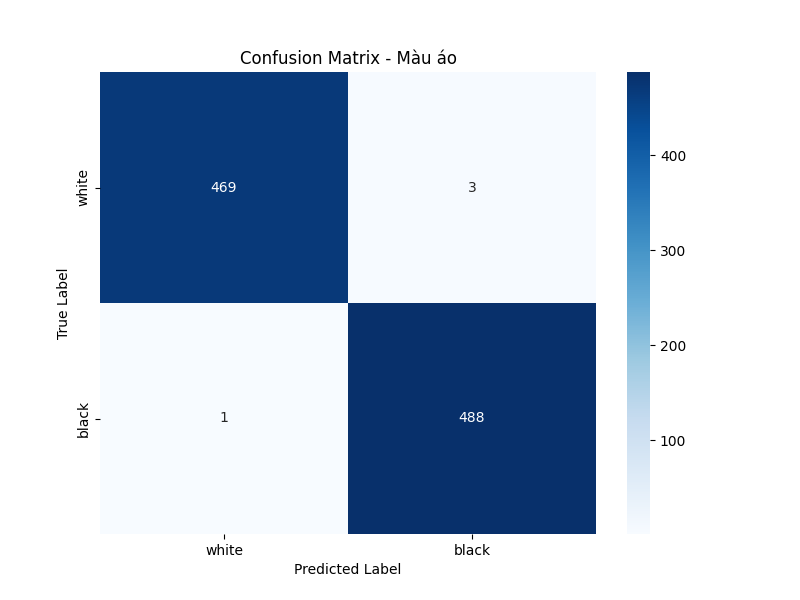
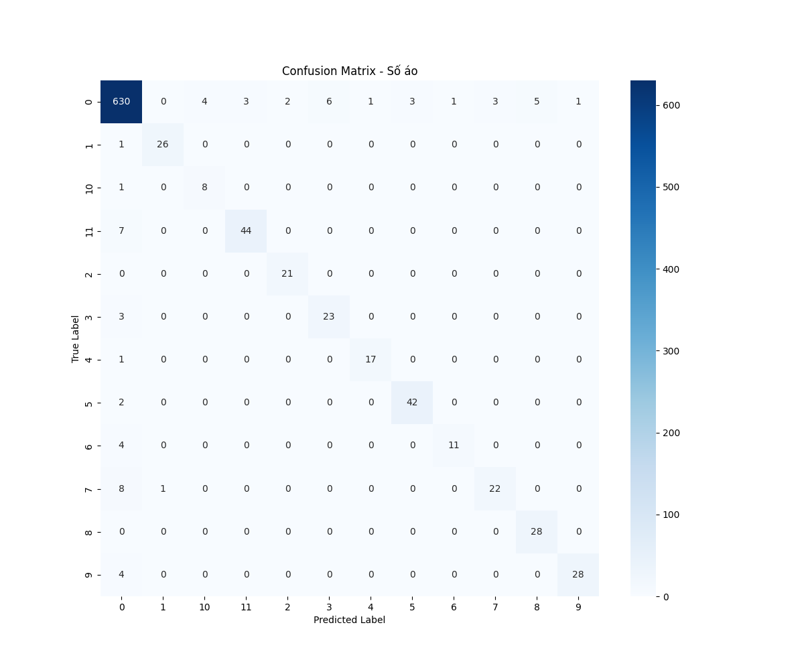

# AI Pipeline for Soccer Player Jersey Detection and Classification



A project to build an AI Pipeline for detecting and classifying player jersey numbers from soccer videos, using advanced deep learning techniques. The pipeline consists of two main models: Object Detection and Image Classification.

## 🌟 Key Features

- **Player and ball detection** using YOLOv11
- **Jersey number classification** with high accuracy
- **Team color classification** (white/black)
- **Video processing** to create annotated output videos



## 📋 Project Structure

```
FootballDnC/
├── data/                  # Original data directory
├── dataset/               # Processed dataset for YOLO
├── classification_dataset/ # Dataset for jersey classification
├── docs/                  # Project documentation and analysis
├── models/                # Trained models storage
├── notebooks/             # Jupyter notebooks for analysis
├── results/               # Output results
├── scripts/               # Data processing scripts
└── src/                   # Main source code
    ├── detection/         # Object Detection source code
    ├── classification/    # Image Classification source code
    └── pipeline/          # Code for combining the two models
```

## 🔍 Processing Workflow



1. **Data Preparation**: Extract frames from videos and convert annotations
2. **Object Detection Model Training**: Use YOLOv11 to detect players and the ball
3. **Classification Model Training**: Classify player jersey numbers and team colors
4. **Pipeline Integration**: Combine both models to process videos

## 📊 Results Achieved

### Object Detection (YOLOv11s)

| Object | mAP50 | Precision | Recall |
|--------|-------|-----------|--------|
| Player | 0.993 | 0.977     | 0.985  |
| Ball   | 0.590 | 0.944     | 0.441  |
| Overall| 0.791 | 0.961     | 0.713  |



### Jersey Classification (ResNet50)

- **Jersey Number Accuracy**: 93.65%
- **Team Color Accuracy**: 99.58%
- **Combined Accuracy**: 96.62%




## 🚀 How to Use

### Installation

```bash
# Create conda environment
conda create -n football python=3.10
conda activate football

# Install required libraries
pip install torch torchvision
pip install ultralytics
pip install numpy pandas matplotlib opencv-python scikit-learn tqdm
```

### Data Preparation

```bash
# Prepare data for YOLO
python scripts/prepare_yolo_dataset.py

# Prepare data for jersey classification
python scripts/prepare_classification_dataset.py
```

### Model Training

```bash
# Train Object Detection
python src/detection/train_experiment.py

# Train Jersey Classification
python src/classification/train_multilabel.py
```

### Running the Pipeline

```bash
# Process video
python src/pipeline/main.py \
  --detection-model models/detection/best.pt \
  --classification-model models/multilabel/best.pt \
  --input-video path_to_input_video.mp4 \
  --output-video result.mp4
```

## 📝 Detailed Documentation

- [Project Plan](docs/ProjectPlan.md)
- [Data Analysis](docs/1.DataAnalysis.md)
- [Data for Object Detection](docs/2.DataForObjectDetection.md)
- [Object Detection Training](docs/3.TrainObjectDetectionModel.md)
- [Data for Image Classification](docs/4.DataForImageClassification.md)
- [Image Classification Training](docs/5.TrainImageClassification.md)
- [Multi-label Model with ResNet50](docs/5.ImageClassificationPretrainedAndMultilabel.md)
- [Integrated Pipeline](docs/6.Pipeline.md)

## 🔮 Future Development

- Improve ball detection accuracy
- Integrate player tracking in videos
- Optimize pipeline for real-time video processing
- Extend team classification based on jersey colors

---

[pipeline-diagram]: docs/images/pipeline-diagram.png "Pipeline Illustration"
[result-example]: docs/images/result-example.png "Example Result"
[workflow-diagram]: docs/images/workflow-diagram.png "Processing Workflow"
[detection-results]: docs/images/detection-results.png "Object Detection Results"
[jersey-confusion-matrix]: docs/images/jersey-confusion-matrix.png "Jersey Confusion Matrix"